# Slash flag
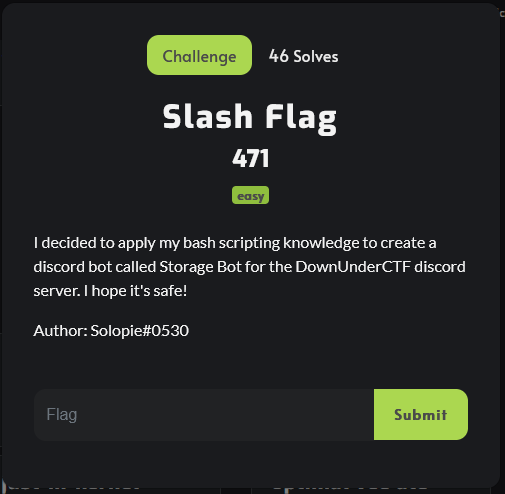
## Contents
1. [[#Preface]]
2. [[#Just use a command simple right]]
3. [[#This is not the command you're looking for]]
4. [[#This is gonna get a little creative]]
5. [[#Is this a flag]]
6. [[#Final thoughts]]

## Preface
I only started writing this after the event, so some information has been added in after the fact, and screenshots might show slightly different results than I originally saw

So a long time ago discord used to be a wild place where to have a bot running, you would have to either run it under your own account, or create one just for it, and discord didn't like it because you could scrape invites and raid through them, so they turned them into OAuth applications requiring 'manage server' permissions, so they could no longer be abused in that way.
## Just use a command, simple right?
First thing's first, you want to figure out what it does right?
Tried the good o'l `!help` and a few equivalents in a DM, to no avail
Let's actually look at its profile properly
 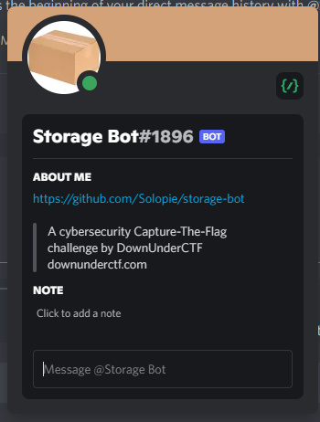
 Open source, very nice
 A cursory glance reveals that it has `clear`, `create`, `delete`, `list`, and `open` as available commands
 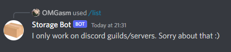 [^1]

Oh, I guess you can't use it privately, that's a shame
Time to experiment on the bot spam channel in public :s
*a few moments later*
absolutely nothing
let's try something fancy I just learned from another competitor the night before

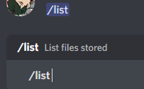
Turns out you can embed slash commands in chat just like mentions and channels with `</name:commandid>`, and you can grab that id by right clicking on that command popup which I got from the DM (with developer mode enabled)
But it's also weird that it's showing up a little unusual because normally it appears like this:
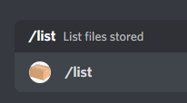
Time to use it anyway
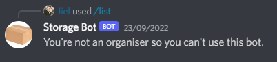
Oh bugger, I know this bot doesn't have any role granting capabilities, and the only other bot that does is actually reasonably secured(I had already jokingly tried giving myself another role earlier)
My immediate next thought was to check to see if it had an invite to server button, and nope, nothing there either.
Because I had actually operated my own bot previously, I remembered that the button is just a link to the same link that you used to have to manually get and send to someone for them to invite it to their server.
Lucky for me I didn't even have to go further than typing `discord oauth` into my url bar to find an old invite link I could modify, however this link involved wildly different capabilities, none of which even included command usage, so I begrudgingly looked up discord bot oauth, which at least this time already had an example that was perfect for this, no broken url redirects nor unsuitable capabilities.
All I had to do now was just replace the id with the bot id
https://discord.com/oauth2/authorize?client_id=1006037829345882173&permissions=0&scope=bot%20applications.commands
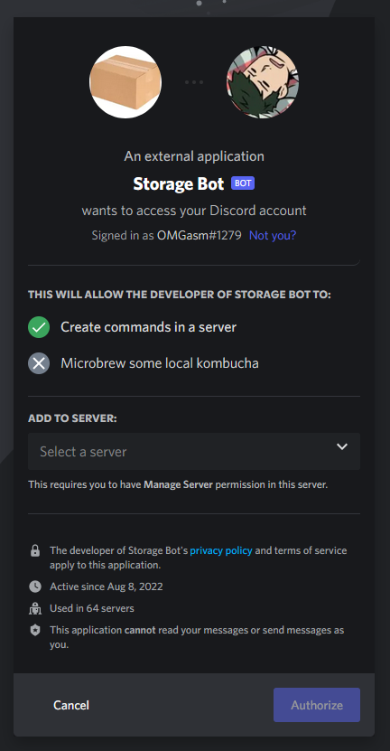 [^2]
Just had to go through the process of logging into discord through my browser and authorising it to one of my private servers, and now we're getting somewhere :)
Run a command to sanity check things

Oops, forgot about that one, time to create a role for that
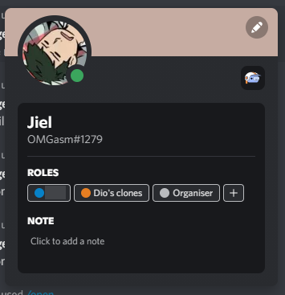
Here we go again and

Nice! Not the result I was after, but a huge step forward

## This is not the command you're looking for
Time to have another look at the code. The files might have something useful
```sh
RUN mkdir /mounts && mkdir /storage
RUN mkdir /flag && mv ./flag.txt /flag/
```
So no we know where stuff is stored, but how do we get there?
Let's have a look at `open.js`
It looks like the two most important lines here are 
```js
const filename = quote(interaction.options.getString("filename").toUpperCase().split(" "));
//...
out = await runCommand(`cat ${filename}`, interaction.guildId);
```
At first glance this looked like the parameters to `runCommand` were very vulnerable to command injection, but alas
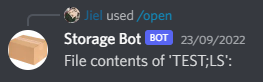
That explains why I typed `flag` but got `FLAG`, but it also separates words to an array? Interesting, running a quick test in Node gives me this
```js
> `cat ${["A","B","C"]}`
'cat A,B,C'
```
How annoying
I probably spent a little too long focusing on this before I realised a key detail about that first line of code... `quote()`
Having a quick look reveals this
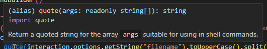
So it turns out that it actually wasn't vulnerable through this method, now what?
List? Clear? Unfortunately these don't appear to take any user input.
Delete? Turns out the parameters were sanitised like in /open. [^3]

Now we're down to one command, it's hopefully gonna be create[^4]
This time there are 3 particular lines of interest, which are very similar to open
```js
const filename = interaction.options.getString("filename").toUpperCase();
const text = quote(interaction.options.getString("text").split(" "));
//...
await runCommand(`echo '${text}' > ${filename}`, interaction.guildId);
```
What's this? Filename injection? Nice.

## This is gonna get a little *creative*
Let's try something
`/create` filename: `test ls>t.txt` text: `1`
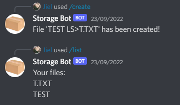
This looks promising
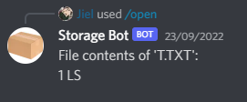
Damnit, not quite
*many, attempts later*
Finally realised that the filenames are all converted to uppercase, so I'd have to figure something to get them back to lowercase, due to linux (by default) using case sensitive filesystems, and bash being a case sensitive shell
I spent a good while on figuring this one out.
Eventually I realised the file contents actually preserved the text, so I started trying to execute the contents of a file.
After many attempts I finally had this:
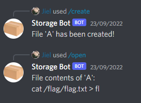
*a few more attempts at executing said file*
This time I tried some "dot sourcing"
`/create` filename: `q $(. a)` text: `q`
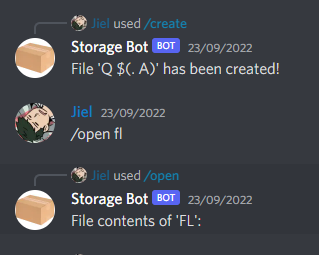 [^5]
[internal screaming] ~~maybe a small amount of external at this point~~
So close it hurts!
But wait! There's more!
## Is this a flag?
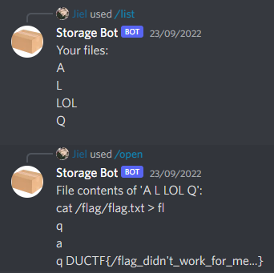
I thought the contents were going to go into `fl`, but it turns out it somehow went into `Q`!
Flag get! 😩


## Final thoughts
While I was a little sad to have missed out on the blood (by almost an entire hour!), I think coming in 2nd place for this challenge is still an amazing feat.
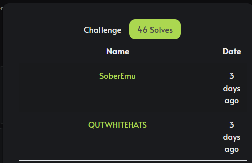
Also this was very fun :D

[^1]:Previously the bot would actually not respond at all, and discord would throw you an error. I can only imagine how many people suddenly realised how big of a hint this message was
[^2]: Yeah, it definitely wasn't 64 servers at the time I was actually doing the challenge
[^3]: Of course, I spent some time with this one while investigating along side open before I realised what was going on
[^4]: Through the magic of anachronic story telling, little did you know that this was actually the 2nd file I opened, but initially didn't understand how it worked because I was too far down other rabbit holes
[^5]: Holy shit you have no idea how often discord would't run the command and just send it as a plain message